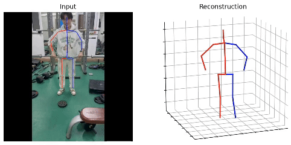

# MHFormer: Multi-Hypothesis Transformer for 3D Human Pose Estimation [CVPR 2022]




## Installation

- Create a conda environment: ```conda create -n mhformer python=3.9```
- Install PyTorch 1.7.1 and Torchvision 0.8.2 following the [official instructions](https://pytorch.org/)
- ```pip3 install -r requirements.txt```
  
## Dataset setup

Please download the dataset from [Human3.6M](http://vision.imar.ro/human3.6m/) website and refer to [VideoPose3D](https://github.com/facebookresearch/VideoPose3D) to set up the Human3.6M dataset ('./dataset' directory). 
Or you can download the processed data from [here](https://drive.google.com/drive/folders/112GPdRC9IEcwcJRyrLJeYw9_YV4wLdKC?usp=sharing). 

```bash
${POSE_ROOT}/
|-- dataset
|   |-- data_3d_h36m.npz
|   |-- data_2d_h36m_gt.npz
|   |-- data_2d_h36m_cpn_ft_h36m_dbb.npz
```

## Download pretrained model

The pretrained model can be found in [here](https://drive.google.com/drive/folders/1UWuaJ_nE19x2aM-Th221UpdhRPSCFwZa?usp=sharing), please download it and put it in the './checkpoint/pretrained' directory. 

## Test the model

To test on a 351-frames pretrained model on Human3.6M:

```bash
python main.py --test --previous_dir 'checkpoint/pretrained/351' --frames 351
```

Here, we compare our MHFormer with recent state-of-the-art methods on Human3.6M dataset. Evaluation metric is Mean Per Joint Position Error (MPJPE) in mm​. 


|   Models    |  MPJPE   |
| :---------: | :------: |
| VideoPose3D |   46.8   |
| PoseFormer  |   44.3   |
|  MHFormer   | **43.0** |


## Train the model

To train a 351-frames model on Human3.6M:

```bash
python main.py --frames 351 --batch_size 128
```

To train a 81-frames model on Human3.6M:

```bash
python main.py --frames 81 --batch_size 256
```

## Demo
First, you need to download YOLOv3 and HRNet pretrained models [here](https://drive.google.com/drive/folders/1_ENAMOsPM7FXmdYRbkwbFHgzQq_B_NQA?usp=sharing) and put it in the './demo/lib/checkpoint' directory. 
Then, you need to put your in-the-wild videos in the './demo/video' directory. 

Run the command below:
```bash
python demo/vis.py --video sample_video.mp4
```

Sample demo output:

<p align="center"></p>


## Citation

If you find our work useful in your research, please consider citing:

    @inproceedings{li2022mhformer,
      title={MHFormer: Multi-Hypothesis Transformer for 3D Human Pose Estimation},
      author={Li, Wenhao and Liu, Hong and Tang, Hao and Wang, Pichao and Van Gool, Luc},
      booktitle={Proceedings of the IEEE/CVF Conference on Computer Vision and Pattern Recognition (CVPR)},
      pages={13147-13156},
      year={2022}
    }

    @article{li2023multi,
      title={Multi-Hypothesis Representation Learning for Transformer-Based 3D Human Pose Estimation},
      author={Li, Wenhao and Liu, Hong and Tang, Hao and Wang, Pichao},
      journal={Pattern Recognition},
      volume={141},
      pages={109631},
      year={2023},
    }

## Acknowledgement

Our code is extended from the following repositories. We thank the authors for releasing the codes. 

- [ST-GCN](https://github.com/vanoracai/Exploiting-Spatial-temporal-Relationships-for-3D-Pose-Estimation-via-Graph-Convolutional-Networks)
- [VideoPose3D](https://github.com/facebookresearch/VideoPose3D)
- [3d-pose-baseline](https://github.com/una-dinosauria/3d-pose-baseline)
- [3d_pose_baseline_pytorch](https://github.com/weigq/3d_pose_baseline_pytorch)
- [StridedTransformer-Pose3D](https://github.com/Vegetebird/StridedTransformer-Pose3D)
## Licence

This project is licensed under the terms of the MIT license.

## 姿态识别

### ui界面

运行下列代码

```
python ui/gradio_estimate.py
```

### 模型训练

打开ui/train.py，修改第54行，将需训练的姿态动作视频放入一个文件夹当中，并修改训练路径，同时修改mode，接下来会自动训练该文件夹下的所有视频。

注意训练前请先运行一下相关动作的_data文件，但切记，开始训练后不要再运行该文件，该文件会刷新训练后的npz文件，同样对于新的训练集，直接替换掉原来的训练集，开始训练即可。

